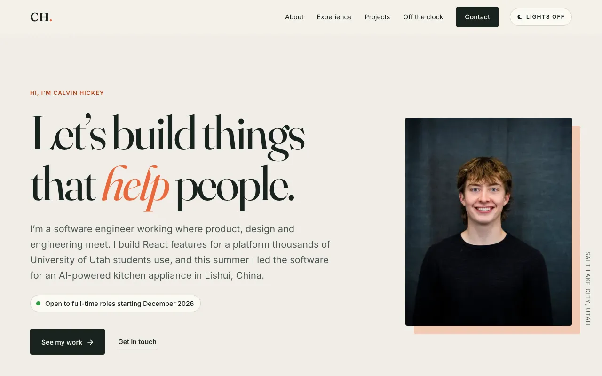
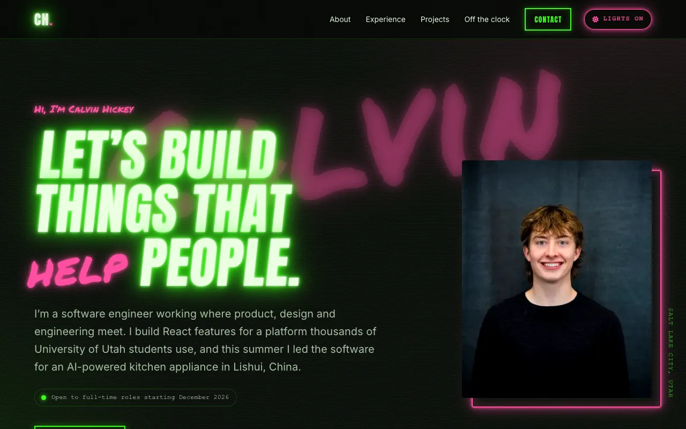

# Calvin Hickey · Portfolio

[](https://github.com/00Calvin00/Calvin_Hickey_Portfolio/actions/workflows/ci.yml)

My personal site: who I am, what I've built, and what I do when I'm away from a keyboard.

**Live site:** https://00calvin00.github.io/Calvin_Hickey_Portfolio/

| Light ("lights on")                                                | Dark ("lights off")                                            |
| ------------------------------------------------------------------ | -------------------------------------------------------------- |
|  |  |

## Highlights

- **Two themes with distinct personalities.** The light theme is an editorial layout on warm paper. The dark theme is neon tubes and spray paint on a concrete wall, matching my [GitHub profile](https://github.com/00Calvin00). The theme follows your OS setting until you pick one, and it never flashes the wrong colors on load.
- **A playable drum machine.** An original groove from my drum studio, as a 16-step sequencer. The kit is synthesized with the Web Audio API, so there are no audio files, and a look-ahead scheduler keeps sound and visuals on the same clock.
- **Accessible by default.** It has a skip link, landmarks, logical heading order, visible focus, and AA contrast in both themes. The mobile menu is a proper disclosure widget, the drum grid uses a roving tabindex, and every animation respects `prefers-reduced-motion`.
- **Fast.** Lighthouse scores 97 / 100 / 100 / 100 on mobile and 100 across the board on desktop. Images are responsive WebP with JPEG fallbacks, fonts are self-hosted subsets, icons come from a 32-icon SVG sprite instead of an icon font, and the drum machine only loads when you scroll to it.

## How it's built

The site is plain HTML, CSS and JavaScript with **no framework and no build step**. What's in `site/` is exactly what gets deployed. A one-page site doesn't need a bundler, and keeping it framework-free let me focus on the fundamentals.

| Concern                 | Approach                                                                                                                                                                                                  |
| ----------------------- | --------------------------------------------------------------------------------------------------------------------------------------------------------------------------------------------------------- |
| CSS architecture        | Cascade layers (`tokens → base → layout → components → themes → utilities`) keep specificity predictable. Every color, font and size is a custom property, so the dark theme mostly swaps tokens.         |
| Theming                 | `js/head.js` runs before first paint to set `data-theme` (and an `html.js` flag that prevents layout shift). `js/main.js` handles the toggle, `aria-pressed` and `<meta name="theme-color">`.             |
| Progressive enhancement | Everything is readable without JavaScript. The mobile nav wraps instead of collapsing, the drum machine falls back to its written notation, and scroll reveal only hides content it is already observing. |
| Assets                  | Small Node scripts regenerate optimized images (`sharp`), the icon sprite (Font Awesome Free) and the font subsets (Fontsource), so nothing in `site/` is hand-exported.                                  |
| Quality gates           | Prettier, Stylelint, ESLint and html-validate (with its accessibility rules) run locally and in CI, along with a link check and Lighthouse budgets.                                                       |

## Project structure

```
site/                 Deployed as-is to GitHub Pages
  index.html          The page
  404.html            "Missed the beat" error page
  css/styles.css      All styles, organized by cascade layer
  js/head.js          Pre-paint theme + JS flag (blocking, tiny)
  js/main.js          Theme toggle, mobile menu, scroll reveal, lazy-loads groove.js
  js/groove.js        Web Audio drum sequencer
  img/  fonts/        Generated assets (see scripts/)
assets/               Full-size source images and the social-image template
scripts/              Asset pipeline: images, icon sprite, fonts
.github/workflows/    CI and deployment
```

## Local development

Requires Node 20 or newer.

```bash
npm ci            # install dev tools (none of them ship to the site)
npm run serve     # http://localhost:4173
npm run lint      # Prettier, Stylelint, ESLint, html-validate
npm run format    # auto-fix formatting
```

Asset scripts:

```bash
npm run images    # assets/images/* -> responsive WebP + JPEG in site/img/
npm run icons     # rebuild site/img/icons.svg from the icon list in scripts/build-icons.js
npm run fonts     # copy font subsets and licenses into site/fonts/
```

## Deployment

Every pull request runs lint, a link check and Lighthouse CI. Merging to `main` runs the same checks, then publishes `site/` to GitHub Pages ([`.github/workflows/ci.yml`](.github/workflows/ci.yml)). Pages must be set to deploy from **GitHub Actions** (Settings → Pages → Source).

## Keeping it current

- **Now section:** edit the list in `site/index.html` and update the "Last updated" date.
- **Interest photos:** add the original to `assets/images/`, list it in `scripts/optimize-images.js`, run `npm run images`, then add an `` as the first child of its card.
- **Resume:** drop the PDF at `site/files/` and link it from the hero and contact sections.

## License

The code is [MIT licensed](LICENSE). The written content, photos and resume are © Calvin Hickey, all rights reserved. Fonts are under the SIL Open Font License (see `site/fonts/`), and icons are from [Font Awesome Free](https://fontawesome.com/license/free) (CC BY 4.0).
